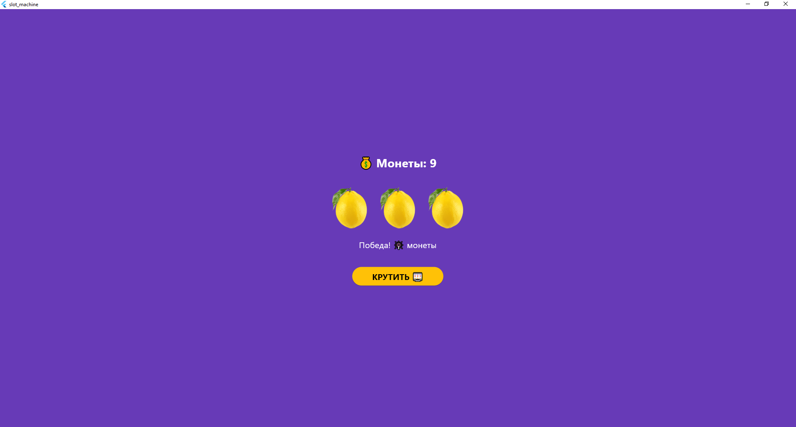

# Лабораторная работа №6. Flutter: StatefulWidget и управление состоянием

### Информация об авторе
**Студенты:** Зламанюк А.А.; Телятникова Е.П.

**Группа:** ИСП-231

**Дата:** 29.04.2026

## Что изучили в ходе работы

- Создание **StatefulWidget** и управление состоянием виджета через класс `State`.
- Генерация случайных чисел с помощью библиотеки `dart:math` для имитации вращения барабанов.
- Работу с **анимациями**: анимированная прозрачность (`AnimatedOpacity`), плавная смена текста (`AnimatedSwitcher`) и пошаговая симуляция вращения с замедлением.
- Логику блокировки UI во время асинхронных операций (флаг `_isSpinning`) и защиту от отрицательных монет.
- Выделение повторяющихся виджетов в отдельные компоненты (например, `SlotRow`) для улучшения читаемости кода.

## Скриншот финального приложения



## Инструкция по запуску
1. Клонируйте репозиторий:
   ```bash
   git clone https://github.com/AnastasiaZlamanyuk/Flutter_lab6.git
   cd Flutter_Lab6
   ```
2. Установите зависимости:
   ```bash
   flutter pub get
   ```
3. Подключите устройство или эмулятор, либо используйте Chrome:
   ```bash
   flutter run -d chrome
   ```
4. Дождитесь сборки и наслаждайтесь приложением.